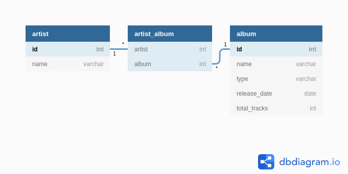

# Getting started

## Requirements

This server comes with a container, which is described in Dockerfile-Flask.

It requires :

- docker

- the credentials for the Spotify API, in the file credentials.py (an example of the form of the file is presented in credentials_example.py) 

- one or two database (one for production, one for developpement), the port and their IP Adress. In the end of this file, we will see how to create postgres container, how to get their IP and see them on pgadmin

## Set up the database :  Launch Postgres Database Container
```
docker run --rm -p 5432:5432 -v $PWD/groover_database:/var/lib/postgresql/data --name postgres -e POSTGRES_PASSWORD=password postgres
```
- The default user is _postgres_
- Teh database will be stored in the folder $PWD/groover_database (the folder groover_database in the current folder). Simply this parameter if you want to change the location

__Warning : the volume must be mount on the local and not on a mounted partition (or it will make file autorization error__

> You can set up as many database as you want as long as you map the port of your new database on an unused port

## Set up the viewer for the database : Launch Postgres Admin Container
```
docker run -p 8888:80 --rm --name pgadmin -e 'PGADMIN_DEFAULT_EMAIL=nabil@gmail.com' -e 'PGADMIN_DEFAULT_PASSWORD=SuperSecret' dpage/pgadmin4
```
_Warning : PGADMIN_DEFAULT_EMAIL must be a valid email with @ and .com_

- This operation might be long. After a few minutes, the pgadmin page should be available at localhost:\<port that you mapped when you launched the container\> (here 8888)
>
>### Connect to the pgadmin page in a container
>- Right click on server
>- Click on _Create > Server..._
>- Add the IP adress and the port. For that, you have 2 options :
>
>__1st : using the container host__
>- To find the host name of the container, type on a terminal
>```
>docker network inspect bridge
>```
>- Find the right container by name, the host should >look like _172.17.0.4_ (it is the ip adress of the >network inside the container)
>- Always use 5432 for the port whatever you mapped (because it is the port used by postgres image inside the container)
>- The default user is _postgres_
>- The default password should be specified as an environment variable when the container is launched
>
>__2nd : using the host port__
>- Find the host container ip using the command ```iftable``` or in _Settings > Detail (next to the >switch button) > IPv4 Adress)_ (cf : https://techwiser.com/find-ip-address/) 
>- Use the mapped port for the port (the one you choosed in the -p parameters, the one which is on the left of the colon)
>- The default user is _postgres_
>- The default password should be specified as an environment variable when the container is launched

## Launch the server
- Change the config.py file with the ip and the post of your container for development and production (it should be accessible using the ```docker network inspect bridge``` command or by seeing the ip of your host server. See _Connect to the pgadmin page in a container_ on this file for more info)
- Inside the file, at the same folder where there is the _Dockerfile-flask_ file, type in a terminal :

__WARNING : Don't forget the credential in secret/credentials.py and the config in config.py__
```
docker build -t groover -f Dockerfile-flask .
```
- When the container is build, type in a terminal :
```
docker run -it --rm -p 3000:3000 -v $PWD:/app --name groover --env FLASK_ENV="developpement" groover
```
_Warning : you are launching the container in a development mode. If you want to launch it in production, simply change ```-v $PWD:/app --env FLASK_ENV="developpement"``` to ```-v $PWD/logs:/app/logs --env FLASK_ENV="production"```_ 

- Launching in a production will also launch a cronjob to retrieve new album everyday at 8am from the spotify API and launch the server on 0.0.0.0:3000 (or on what you precesed in the config.py file). You can change the frequence of retrieving the artist by changing the file crontab (look online for crontab for more info on how to set the frequence)
- Launching in a development will simply open a terminal. You can then lauch the app using ```python server/app.py```.

## Test
- A request can be send by launching the tests/test_request.py file. 

_Pay attention to  where you launch it. If your app is launched on 127.0.0.1 or localhost (look for the output when launching the container), then you should launch it inside the container (look online for docker exec for more info). If it is launched on 0.0.0.0, then you should launch your test on your host machine (using curl or the browser, etc...)._

## Organisation of the database



## Documentation
- on SQLAlchemy

https://www.youtube.com/watch?v=4gRMV-wZTQs

- on cronjob

https://technique.arscenic.org/commandes-linux-de-base/article/cron-gestion-des-taches-planifiees
